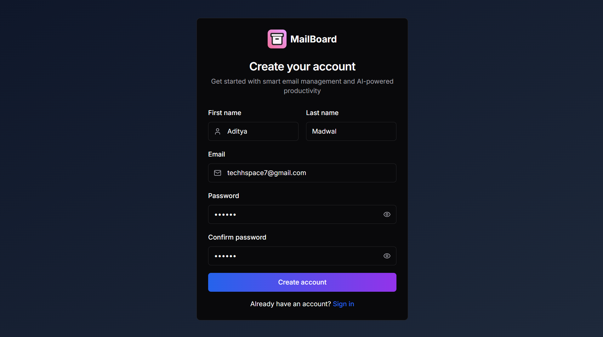
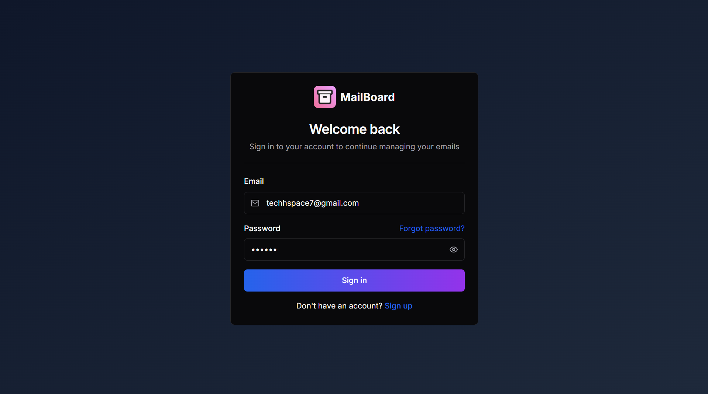
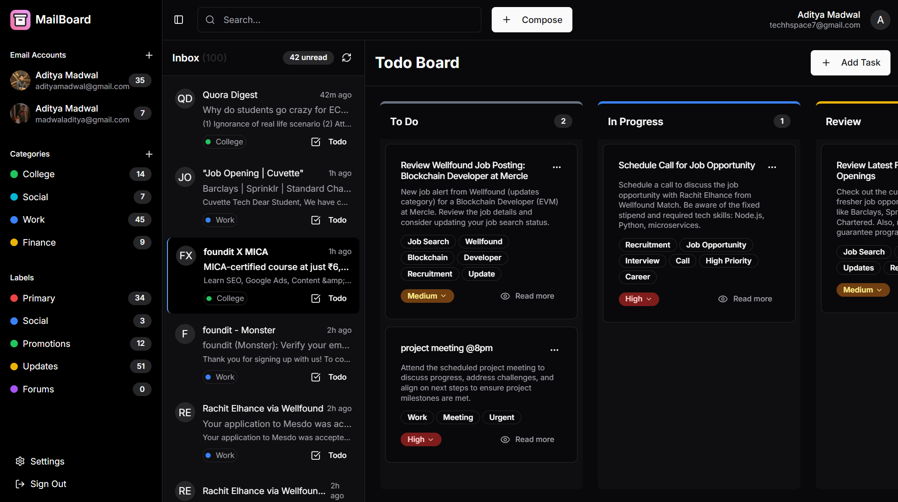
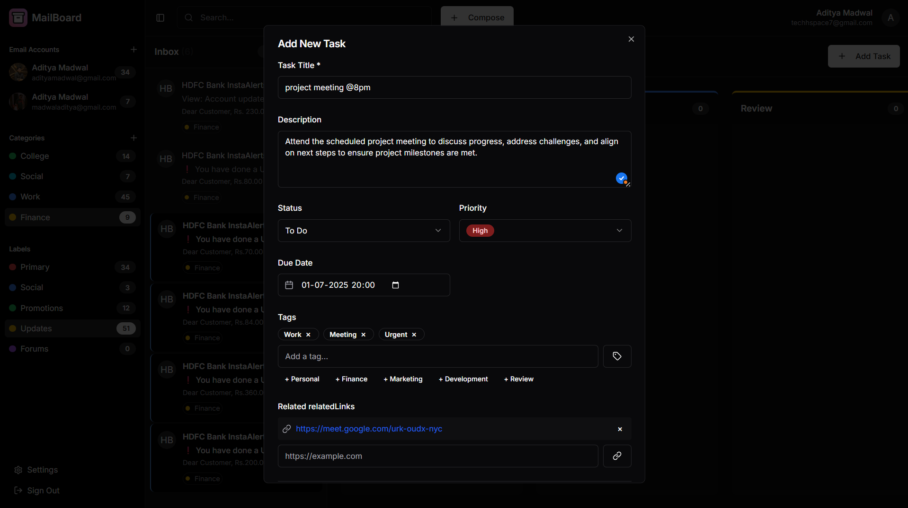
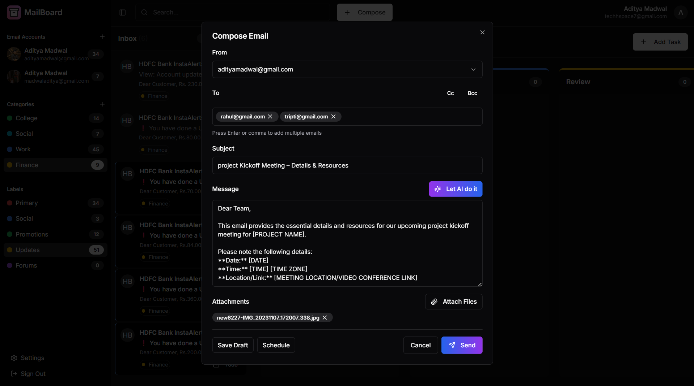
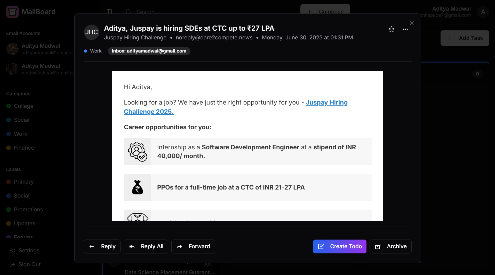
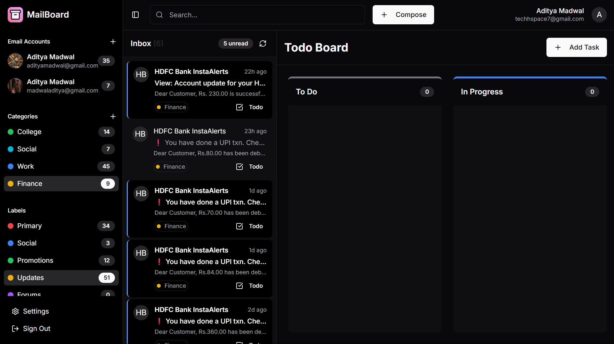
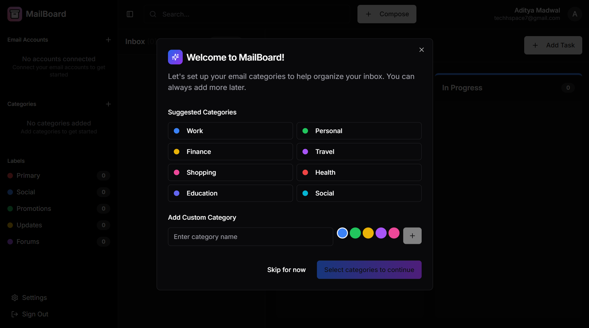
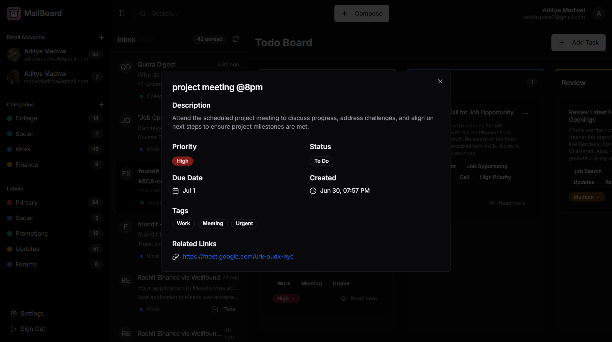

# 📬 MailBoard

**MailBoard** is a modern, AI-powered **email management and productivity application** built with **Next.js**. It enables users to register, sign in securely, manage their inbox, and streamline communication through a clean, responsive UI. Future plans include smart filtering, AI categorization, and productivity analytics — tailored for power users and professionals.

---

## 🚀 Features

✅ **User Registration & Login** – Secure signup and login system with form validations  
✅ **Responsive UI** – Beautifully designed form and layout for both desktop and tablets  
✅ **Modern Tech Stack** – Built using the latest features in **Next.js**, including app router and server components  
✅ **Authentication-ready** – Ready for integration with **JWT**, **OAuth**, or third-party providers  
✅ **Modular & Scalable Structure** – Clean codebase ready for production-level extensions  
✅ **Dark Mode UI** – Designed with accessibility and modern aesthetics in mind
✅ **Auto Resource Extraction** – Automatically extracts important links from emails when converting them into tasks
✅ **Smart Email Categorization** – AI-driven categorization of emails for better inbox organization  
✅ **AI-based Email Generation** – Drafts contextual replies or new emails based on subject and history  
✅ **Multi-Inbox Management** – Supports connecting and managing multiple inboxes simultaneously

---

## 🛠 Tech Stack

- **Frontend & Backend:** Next.js 14 (App Router)
- **Styling:** Tailwind CSS & Radix UI
- **Authentication:** JWT
- **AI Integration:** Gemini API for smart email summarization, categorization and generation
- **Deployment:** Vercel, MongoDB

---

## 🖼 Screenshots

| Screenshot                                   | Description                                           |
| -------------------------------------------- | ----------------------------------------------------- |
|             | Clean and modern user signup interface                |
|               | Login screen with show/hide password toggle           |
|       | AI-powered dashboard showcasing latest email insights |
|          | Convert email to task with auto-filled metadata       |
|           | Compose window with AI email suggestion feature       |
|  | Detailed view of an email and inline actions          |
|         | AI-categorized email filtering view                   |
|     | Introductory onboarding screens for first-time users  |
|    | Expanded task with linked email and resources         |

---

## 📦 Installation

### 🔧 Prerequisites

Make sure you have:

- Node.js (v18+ recommended)
- npm or yarn
- [Optional] PostgreSQL or MongoDB if extending with database

---

### 🚀 Local Setup

```bash
# Clone the repo
git clone https://github.com/aditya-madwal/mailboard.git
cd mailboard

# Install dependencies
npm install

# Start development server
npm run dev
```

---

## 🧠 Roadmap

- [ ] Email inbox integration
- [ ] Smart AI filters & summarization using Gemini AI
- [ ] Label and Category based organization
- [ ] Multiple Emails support
- [ ] Auto resource extraction from emails
- [ ] AI-generated emails

---

## 📄 License

This project is open-source and available under the **MIT License**.
